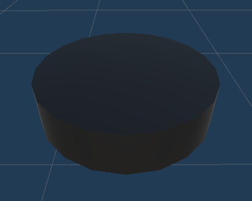
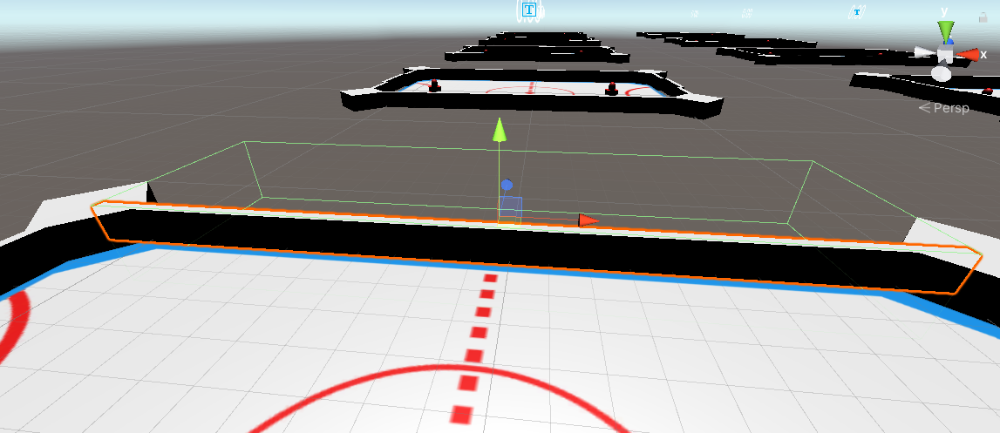
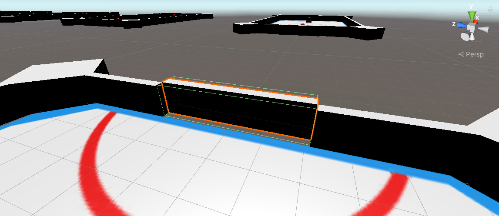
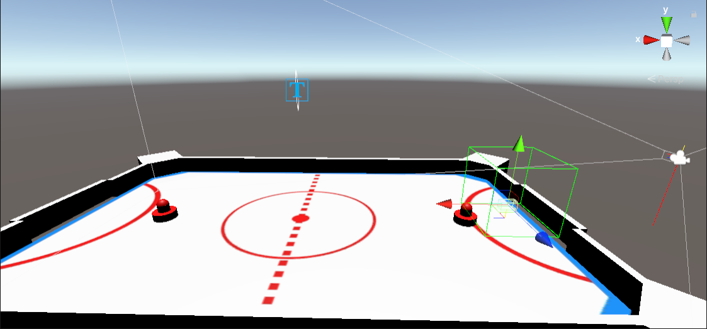
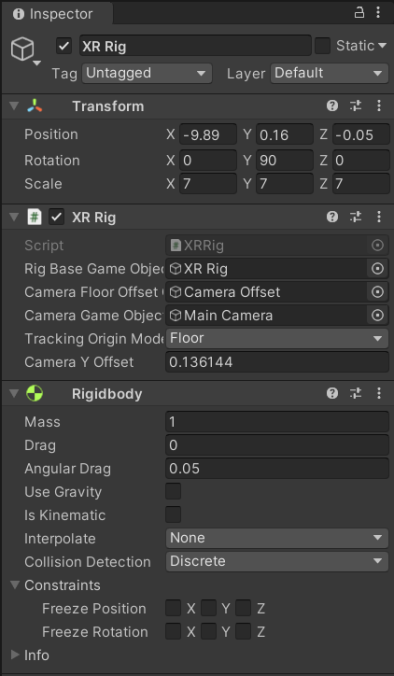

# VR AIrHockey

In deze tutorial wordt uitgelegd hoe je een eigen VR air-hockey game maakt die gebruik maakt van machine learning. Er staat stap voor stap beschreven hoe je tot deze oplossing komt. Er wordt uitgelegd welke installaties, objecten en scripts er vereist zijn om een werkende VR air-hockey game te maken. De tutorial beschrijft hoe je de AI traint en welke resultaten je kan verwachten uit deze training.

## Inhoudsopgave

1. [Benodigdheden](#1-benodigdheden)
1. [Inleiding](#2-inleiding)
1. [One-pager](#3-one-pager)
1. [Objecten](#4-objecten)
1. [Agent](#5-agent)
1. [Scripts](#6-scripts)
1. [Training](#7-training)
1. [Oculus Quest 2](#8-oculus-quest-2)
1. [One-pager](#9-one-pager)
1. [Conclusie](#10-conclusie)

## 1. Benodigdheden

1. Unity Hub 2.4.1 (<https://unity3d.com/get-unity/download>)
1. Unity versie 2019.4.11f1 (<https://unity3d.com/unity/whats-new/2019.4.11>)
1. ML-agents release 6 package (<https://github.com/Unity-Technologies/ml-agents/releases/tag/release_6>)
1. Visual Studio Community  (<https://visualstudio.microsoft.com/downloads/>)
1. Python 3.8.6 (<https://www.python.org/downloads/>)
1. SideQuest (https://sidequestvr.com/setup-howto)
1. Oculus Quest 2 (VR-Bril)

## 2. Inleiding

VR AIrHockey is een spel waarbij een speler tegen een AI speelt. De speler kan met zijn VR controllers de zogenaamde `Hammer` vastnemen om te slagen tegen de `Puck`. Op deze manier moet hij 5 punten halen om te winnen.

Doorheen dit document worden drie belangrijke aspecten aangeleerd. Ten eerste het bouwen van een Unity omgeving om het spel te kunnen spelen. Ten tweede een Artificial Inteligence Agent aanleren hoe hij het spel airhockey moet spelen. En ten derde hoe we deze omgeving kunnen combineren met het VR-aspect.

| Student                  | Email           |
|--------------------------|:---------------:|
| Kristof De Winter        | s106749@ap.be   |
| Felix Neijzen            | s109332@ap.be   |
| Bram Van Chronenburg     | s109544@ap.be   |
| Jonathan De Baerdemaeker | s108835@ap.be   |
| Luka Hendrickx           | s109055@ap.be   |

## 3. One-pager

### 3.1 Spelverloop

De speler start het spel met een `Puck` te nemen en die op het veld te plaatsen met zijn controllers. Eenmaal de `Puck` geplaatst is start het spel en kan de spelere met zijn `Hammer` slagen tegen de `Puck`. Op deze manier kan de speler scoren in de goal van de tegenstander. Als de speler of de AI 5 punten kan scoren bij zijn tegenstander heeft hij gewonnen. Hierna stopt het spel. Dit spelverloop word door het onderstaande draaiboekje uitgebeeld.


### 3.2 Meerwaarde

Het AI-component van dit project heeft als meerwaarde dat een AI tegenstander moeilijker te voorspellen is. Een goede speler kan in geprogrammeerde tegenstanders patronen vinden en uitbuiten om makkelijk te winnen of hoge scores te behalen, bij een AI tegenstander kan dit niet. De AI traint aan de hand van "adversarial self-play", dit staat de AI toe om tegelijk te leren om de verdedigen en aanvallen.

### 3.3 Interacties

De primaire interactie van de gebruiker is het verplaatsen van zijn eigen "hamer" op het spelbord. Ook heeft de gebruiker een interactie met de puck, deze kan in een richting weggestuurd worden door ertegen te botsen met de hamer. Ook heeft de gebruiker interacties met de agent, aangezien deze als tegenstander fungeert en ook een hamer beweegt om te spelen.

### 3.4 Kwardrant 

De gebruiker ziet een airhockey tafel voor zich, hij drukt op de startknop en hoort de puck uit de gleuf vallen. Hij kijkt naar beneden en pakt deze op om hem op het veld te leggen, ondertussen begint de arcade muziek te spelen en gaat de luchtstroom van de tafel aan. Hij legt de puck op de tafel, neemt dan de pod en slaat de puck met een harde “TOK” ermee naar de andere kant van het veld, waar de AI zal verdedigen en deze probeert terug te kaatsen en zelf te scoren.
Er word gescoord, er speelt een geluid en wanneer de gebruiker opkijkt ziet hij de 1 op het scorebord verschijnen maar het spel is nog niet voorbij, de puck wordt terug op het veld geplaatst en het spel gaat door...

### 3.5 Afwijkingen van de one-pager

Origineel zou deze groep een virtuele schietbaan maken waar de doelwitten bewegen onder controle van een AI, maar na verdere evaluatie kwamen wij tot de conclusie dat deze AI zeer moeilijk te implementeren zou zijn en weinig meerwaarde had over deze handmatig te programmeren. Hierom hebben wij in samenspraak met de leerkrachten besloten om inplaats daarvan een airhockeytafel te maken met een AI tegenstander. Ook stonden in de one-pager voor de airhockey tafel een heel aantal suggesties voor de immersie van de gebruiker (vooral geluiden) maar wij hebben enkel de basisfunctionaliteiten van het spel af gekregen. Dit komt door een combinatie van tijdsdruk, andere projecten en problemen bij het werken in Unity en het trainen van een competente AI.

## 4. Objecten

| Name            | Soort Object                    | Tag             |
|-----------------|:-------------------------------:|:---------------:|
| Environment     | EmptyObject                     | Environment     |
| Hammer-Player   | 3D GameObject (Red)             | Hammer-Player   |
| Hammer-Opponent | 3D GameObject (Red)             | Hammer-Opponent |
| Puck            | 3D GameObject Cillinder (Black) | Puck            |
| Ground          | 3D GameObject Plane             | Field           |
| West-Border     | 3D GameObject Cube              | Border          |
| East-Border     | 3D GameObject Cube              | Border          |
| North-Border    | EmptyObject                     | /               |
| South-Border    | EmptyObject                     | /               |
| Left-Wall       | 3D GameObject Cube              | Border          |
| Right-Wall      | 3D GameObject Cube              | Border          |
| Left-Corner     | 3D GameObject Cube              | Border          |
| Right-Corner    | 3D GameObject Cube              | Border          |
| Goal            | 3D GameObject Cube              | Goal-Opponent   |
| Goal            | 3D GameObject Cube              | Goal-Player     |
| Divider         | EmptyObject Cube                | Divider         |
| Spawn-Puck      | EmptyObject Cube                | /               |
| Scoreboard      | 3D GameObject TextMeshPro (TMP) | Scoreboard      |

### 4.1 Hierarchy


### 4.2 Environment


### 4.3 Hammer


### 4.4 Puck



### 4.5 Border



### 4.6 Goal



## 5. Agent

### 5.1 Observaties

De ML-Agent kan drie verschillende objecten observeren met zijn Ray Perception Sensor 3D. De `Puck` kan hij observeren om te bepalen wanneer hij er tegen moet slagen. Natuurlijk moet hij ook de `GoalPlayer` observeren om de richting te bepalen waar hij de `Puck` naar slaagt. Aangezien er in Air-Hockey ook verdedigt kan worden moet hij de `Hammer` van de speler ook kunnen observeren.

### 5.2 Acties

Inhoudelijk hebben we negen acties voor de ML-Agent:

1. Beweging vooruit
1. Beweging naar rechts
1. Beweging achteruit
1. Beweging naar links
1. Beweging rechts-vooruit
1. Beweging links-vooruit
1. Beweging rechts-achteruit
1. Beweging links-achteruit
1. Geen beweging

Doorheen het spel zal de ML-Agent voortdurend beslissingen maken tussen deze negen acties.

### 5.3 Beloningen

#### 5.3.1 Positieve belongingen

| Actie         | Beloning     |
|---------------|:------------:|
| Puck aanraken | +0.2         |
| Goal maken    | +1           |

#### 5.3.1 Negatieve belongingen

| Actie           | Beloning     |
|-----------------|:------------:|
| Border aanraken | -0.01        |

## 6. Componenten & Scripts

| Object          | Component                                                                    | Script          |
|-----------------|:----------------------------------------------------------------------------:|:---------------:|
| Environment     | /                                                                            | Environment     |
| Hammer-Player   | RigidBodyRay, Perception Sensor 3D, Decision Requester, Behaviour Parameters | Hammer          |
| Hammer-Opponent | RigidBodyRay, Perception Sensor 3D, Decision Requester, Behaviour Parameters | Hammer          |
| Puck            | RigidBody, Mesh Collider                                                     | Puck            |

### 6.1 Environment

Het environment script bevat alle instellingen van de applicatie. Dit script zorgt ervoor dat de puck aan de juiste zijde van het veld wordt gegenereerd. Het spel wordt opnieuw opgestart als er een speler is met vijf punten.

```cshrp
public HammerPlayer player;
public HammerPlayer opponent;
private TextMeshPro scoreBoard;
public Puck puckPrefab;
public GameObject position;

public void OnEnable()
{
    scoreBoard = transform.GetComponentInChildren<TextMeshPro>();
}
```

Bovenaan het script worden de variabelen geïnitialiseerd. In de "OnEnable()" methode wordt de scoreboard variabele opgevuld met het scoreboard object.

```csharp
public void FixedUpdate()
{
    scoreBoard.text = player.GetCumulativeReward().ToString("f2") + " | " + opponent.GetCumulativeReward().ToString("f2");
}
```

In de "FixedUpdate()" methode wordt de score van de agents weergegeven met een precisie van twee cijfers na de komma. Deze methode wordt elke frame aangeroepen, dit zorgt ervoor dat de score van de agent contstant wordt geüpdatet.

```csharp
public void ClearEnvironment(bool playerScored)
{
    if (player.goalAmount > 5)
    {
        player.EndEpisodeHockey();
        opponent.EndEpisodeHockey();
    }
    else if (opponent.goalAmount > 5)
    {
        opponent.EndEpisodeHockey();
        player.EndEpisodeHockey();
    }
    else
    {
        foreach (Transform _object in position.transform)
        {
            Destroy(_object.gameObject);
        }
        SpawnPuck(playerScored);
    }
}
```

In deze methode wordt het environment gereset als de speler of de tegenstander vijf punten heeft behaald. Als geen van beide vijf punten hebben, worden alle objecten verwijderd. De `puck` wordt opnieuw gegenereerd op basis van wie er gescoord heeft. Als de speler gescoord heeft, wordt de `puck` gegenereerd aan de zijde van de tegenstander. Als de tegenstander gescoord heeft, wordt de `puck` gegenereerd aan de zijde van de speler.

```csharp
public void AddPointsPlayer()
{
    player.AddReward(1f);
    player.goalAmount++;
}

public void AddPointsOpponent()
{
    opponent.AddReward(1f);
    opponent.goalAmount++;
}
```

Deze methodes zorgen ervoor dat de agents punten krijgen wanneer er een goal wordt gescoord. De score wordt aangepast afhankelijk van wie er een goal heeft gescoord.

```csharp
using System.Collections;
using System.Collections.Generic;
using TMPro;
using UnityEngine;

public class Environment : MonoBehaviour
{
    public HammerPlayer player;
    public HammerPlayer opponent;
    private TextMeshPro scoreBoard;
    public Puck puckPrefab;
    public GameObject position;

    public void OnEnable()
    {
        scoreBoard = transform.GetComponentInChildren<TextMeshPro>();
    }

    public void FixedUpdate()
    {
        scoreBoard.text = player.GetCumulativeReward().ToString("f2") + " | " + opponent.GetCumulativeReward().ToString("f2");
    }

    public void ClearEnvironment(bool playerScored)
    {
        if (player.goalAmount > 5)
        {
            player.EndEpisodeHockey();
            opponent.EndEpisodeHockey();
        }
        else if (opponent.goalAmount > 5)
        {
            opponent.EndEpisodeHockey();
            player.EndEpisodeHockey();
        }
        else
        {
            foreach (Transform _object in position.transform)
            {
                Destroy(_object.gameObject);
            }
            SpawnPuck(playerScored);
        }
    }

    public void SpawnPuck(bool playerScored)
    {
        if (!playerScored)
        {
            GameObject newPuck = Instantiate(puckPrefab.gameObject);
            newPuck.transform.SetParent(position.transform);
            newPuck.transform.localPosition = new Vector3(-5f, 0f);
            player.transform.localPosition = new Vector3(-5.5f, -0.64f, 0);
            opponent.transform.localPosition = new Vector3(9f, -0.64f, 0);
        }
        else
        {
            GameObject newPuck = Instantiate(puckPrefab.gameObject);
            newPuck.transform.SetParent(position.transform);
            newPuck.transform.localPosition = new Vector3(5f, 0f);
            player.transform.localPosition = new Vector3(-5.5f, -0.64f, 0);
            opponent.transform.localPosition = new Vector3(9f, -0.64f, 0);
        }
    }

    public void AddPointsPlayer()
    {
        player.AddReward(1f);
        player.goalAmount++;
    }
    
    public void AddPointsOpponent()
    {
        opponent.AddReward(1f);
        opponent.goalAmount++;
    }
}
```
### 6.2 Hammer

uitleg volledig script

```csharp
private Environment environment;
public float force = 250f;
private Rigidbody rb = null;
private float dirX = 0f;
private float dirZ = 0f;
public int goalAmount = 0;
public bool matchWon = false;

public override void Initialize()
{
    rb = GetComponent<Rigidbody>();
    environment = GetComponentInParent<Environment>();
}
```

uitleg parameters en initialize

```csharp
public override void OnActionReceived(float[] vectorAction)
{
    dirX = 0f;
    dirZ = 0f;

    if (vectorAction[0] != 0f)
    {
        if (vectorAction[0] == 1f)
        {
            dirZ = force * Time.deltaTime;
        }
        else if (vectorAction[0] == 2f)
        {
            dirZ = force * Time.deltaTime;
            dirX = force * Time.deltaTime;
        }
        else if (vectorAction[0] == 3f)
        {
            dirX = force * Time.deltaTime;
        }
        else if (vectorAction[0] == 4f)
        {
            dirZ = -(force * Time.deltaTime);
            dirX = force * Time.deltaTime;
        }
        else if (vectorAction[0] == 5f)
        {
            dirZ = -(force * Time.deltaTime);
        }
        else if (vectorAction[0] == 6f)
        {
            dirZ = -(force * Time.deltaTime);
            dirX = -(force * Time.deltaTime);
        }
        else if (vectorAction[0] == 7f)
        {
            dirX = -(force * Time.deltaTime);
        }
        else if (vectorAction[0] == 8f)
        {
            dirZ = force * Time.deltaTime;
            dirX = -(force * Time.deltaTime);
        }
    }

    rb.velocity = new Vector3(dirX, 0, dirZ);
}
```

uitleg OnActionReceived methode

```csharp
public override void OnEpisodeBegin()
{
    goalAmount = 0;
    matchWon = false;
    environment.ClearEnvironment(true);
}
```

uitleg OnEpisodeBegin methode

```csharp
public override void Heuristic(float[] actionsOut)
{
    actionsOut[0] = 0f;

    if (Input.GetKey(KeyCode.W))
    {
        if (Input.GetKey(KeyCode.A))
        {
            actionsOut[0] = 8f;
        }
        else if (Input.GetKey(KeyCode.D))
        {
            actionsOut[0] = 2f;
        }
        else
        {
            actionsOut[0] = 1f;
        }
    }
    else if (Input.GetKey(KeyCode.S))
    {
        if (Input.GetKey(KeyCode.A))
        {
            actionsOut[0] = 6f;
        }
        else if (Input.GetKey(KeyCode.D))
        {
            actionsOut[0] = 4f;
        }
        else
        {
            actionsOut[0] = 5f;
        }
    }
    else if (Input.GetKey(KeyCode.A))
    {
        actionsOut[0] = 7f;
    }
    else if (Input.GetKey(KeyCode.D))
    {
        actionsOut[0] = 3f;
    }
}
```

uitleg Heuristic method

```csharp
public void GetPoint()
{
    AddReward(1f);
}
public void EndEpisodeHockey()
{
    EndEpisode();
}
```

uitleg GetPoint en EndEpisodeHockey methodes

```csharp
private void OnCollisionEnter(Collision collision)
{
    if (collision.transform.CompareTag("Puck") == true)
    {
        AddReward(0.2f);
    }
    if (collision.transform.CompareTag("Border") == true)
    {
        AddReward(-0.01f);
    }
}
```

uitleg OnCollisionEnter methode

```csharp
using System.Collections;
using System.Collections.Generic;
using Unity.MLAgents;
using UnityEngine;

public class HammerPlayer : Agent
{
    private Environment environment;
    public float force = 250f;
    private Rigidbody rb = null;
    private float dirX = 0f;
    private float dirZ = 0f;
    public int goalAmount = 0;
    public bool matchWon = false;

    public override void Initialize()
    {
        rb = GetComponent<Rigidbody>();
        environment = GetComponentInParent<Environment>();
    }

    public override void OnActionReceived(float[] vectorAction)
    {
        dirX = 0f;
        dirZ = 0f;

        if (vectorAction[0] != 0f)
        {
            if (vectorAction[0] == 1f)
            {
                dirZ = force * Time.deltaTime;
            }
            else if (vectorAction[0] == 2f)
            {
                dirZ = force * Time.deltaTime;
                dirX = force * Time.deltaTime;
            }
            else if (vectorAction[0] == 3f)
            {
                dirX = force * Time.deltaTime;
            }
            else if (vectorAction[0] == 4f)
            {
                dirZ = -(force * Time.deltaTime);
                dirX = force * Time.deltaTime;
            }
            else if (vectorAction[0] == 5f)
            {
                dirZ = -(force * Time.deltaTime);
            }
            else if (vectorAction[0] == 6f)
            {
                dirZ = -(force * Time.deltaTime);
                dirX = -(force * Time.deltaTime);
            }
            else if (vectorAction[0] == 7f)
            {
                dirX = -(force * Time.deltaTime);
            }
            else if (vectorAction[0] == 8f)
            {
                dirZ = force * Time.deltaTime;
                dirX = -(force * Time.deltaTime);
            }
        }

        rb.velocity = new Vector3(dirX, 0, dirZ);
    }

    public override void OnEpisodeBegin()
    {
        goalAmount = 0;
        matchWon = false;
        environment.ClearEnvironment(true);
    }

    public override void Heuristic(float[] actionsOut)
    {
        actionsOut[0] = 0f;

        if (Input.GetKey(KeyCode.W))
        {
            if (Input.GetKey(KeyCode.A))
            {
                actionsOut[0] = 8f;
            }
            else if (Input.GetKey(KeyCode.D))
            {
                actionsOut[0] = 2f;
            }
            else
            {
                actionsOut[0] = 1f;
            }
        }
        else if (Input.GetKey(KeyCode.S))
        {
            if (Input.GetKey(KeyCode.A))
            {
                actionsOut[0] = 6f;
            }
            else if (Input.GetKey(KeyCode.D))
            {
                actionsOut[0] = 4f;
            }
            else
            {
                actionsOut[0] = 5f;
            }
        }
        else if (Input.GetKey(KeyCode.A))
        {
            actionsOut[0] = 7f;
        }
        else if (Input.GetKey(KeyCode.D))
        {
            actionsOut[0] = 3f;
        }
    }

    public void GetPoint()
    {
        AddReward(1f);
    }
    public void EndEpisodeHockey()
    {
        EndEpisode();
    }
    private void OnCollisionEnter(Collision collision)
    {
        if (collision.transform.CompareTag("Puck") == true)
        {
            AddReward(0.2f);
        }
        if (collision.transform.CompareTag("Border") == true)
        {
            AddReward(-0.01f);
        }
    }
}

```
### 6.3 Puck

Het `Puck` script zorgt ervoor dat de `Puck` vooruit gaat als er met een `Hammer` tegen wordt geslagen. Het script zorgt ervoor dat de `Puck` naar de juiste richting botst als hij in contact komt met de muur.

```csharp
private Environment environment;
private Rigidbody rb;
private float maxSpeed = 25f;

void Start()
{
    rb = GetComponent<Rigidbody>();
    environment = GetComponentInParent<Environment>();
}
```

Bovenaan het script worden de variabelen geïnitialiseerd. In de "Start()" methode wordt de RigidBody variabele opgevuld met de RigidBody van het `Puck` object. De environment variabele wordt opgevuld met de environment component.

```csharp
    void FixedUpdate()
    {
        rb.velocity = Vector3.ClampMagnitude(rb.velocity, maxSpeed);
    }
```

In de "FixedUpdate()" methode wordt de score van de agents weergegeven met een precisie van twee cijfers na de komma. Deze methode wordt elke frame aangeroepen, dit zorgt ervoor dat de score van de agent contstant wordt geüpdatet.

```csharp
    private void OnCollisionEnter(Collision collision)
    {
        if (collision.gameObject.CompareTag("Field"))
        {
            rb.constraints = RigidbodyConstraints.FreezePositionY;
        }
        if (collision.gameObject.CompareTag("HammerPlayer") || collision.gameObject.CompareTag("HammerOpponent"))
        {
            rb.velocity = new Vector3(rb.velocity.x * 5, 0, rb.velocity.z * 5);
        }
        if (collision.gameObject.CompareTag("Border"))
        {
            var orthogonalVector = collision.contacts[0].point - transform.position;
            var collisionAngle = Vector3.Angle(orthogonalVector, rb.velocity);
            transform.rotation *= Quaternion.Euler(0, collisionAngle, 0);
            rb.velocity = new Vector3(rb.velocity.x * 2, 0, rb.velocity.z * 2);
        }
        if (collision.gameObject.CompareTag("GoalPlayer"))
        {
            environment.AddPointsOpponent();
            rb.constraints = RigidbodyConstraints.None;
            rb.constraints = RigidbodyConstraints.FreezeRotation;
            environment.ClearEnvironment(false);
        }
        if (collision.gameObject.CompareTag("GoalOpponent"))
        {
            environment.AddPointsPlayer();
            rb.constraints = RigidbodyConstraints.None;
            rb.constraints = RigidbodyConstraints.FreezeRotation;
            environment.ClearEnvironment(true);
        }
    }
```

TEXT

```csharp
using System.Collections;
using System.Collections.Generic;
using UnityEngine;

public class Puck : MonoBehaviour
{
    private Environment environment;
    private Rigidbody rb;
    private float maxSpeed = 25f;

    void Start()
    {
        rb = GetComponent<Rigidbody>();
        environment = GetComponentInParent<Environment>();
    }

    void FixedUpdate()
    {
        rb.velocity = Vector3.ClampMagnitude(rb.velocity, maxSpeed);
    }

    private void OnCollisionEnter(Collision collision)
    {
        if (collision.gameObject.CompareTag("Field"))
        {
            rb.constraints = RigidbodyConstraints.FreezePositionY;
        }
        if (collision.gameObject.CompareTag("HammerPlayer") || collision.gameObject.CompareTag("HammerOpponent"))
        {
            rb.velocity = new Vector3(rb.velocity.x * 5, 0, rb.velocity.z * 5);
        }
        if (collision.gameObject.CompareTag("Border"))
        {
            var orthogonalVector = collision.contacts[0].point - transform.position;
            var collisionAngle = Vector3.Angle(orthogonalVector, rb.velocity);
            transform.rotation *= Quaternion.Euler(0, collisionAngle, 0);
            rb.velocity = new Vector3(rb.velocity.x * 2, 0, rb.velocity.z * 2);
        }
        if (collision.gameObject.CompareTag("GoalPlayer"))
        {
            environment.AddPointsOpponent();
            rb.constraints = RigidbodyConstraints.None;
            rb.constraints = RigidbodyConstraints.FreezeRotation;
            environment.ClearEnvironment(false);
        }
        if (collision.gameObject.CompareTag("GoalOpponent"))
        {
            environment.AddPointsPlayer();
            rb.constraints = RigidbodyConstraints.None;
            rb.constraints = RigidbodyConstraints.FreezeRotation;
            environment.ClearEnvironment(true);
        }
    }
}
```

## 7. Training

Voordat je kan beginnen met trainen moet er nog een map genaamd "learning" worden aangemaakt. In deze map moet een map genaamd "results" inkomen. In deze map gaan de brains inkomen.

In de map learning moet de yml-file komen.

### 7.1 Yml-file

```json
behaviors:
  Hammer:
    trainer_type: ppo
    max_steps: 5.0e5
    time_horizon: 64
    summary_freq: 10000
    keep_checkpoints: 5
    checkpoint_interval: 50000
    
    hyperparameters:
      batch_size: 64
      buffer_size: 9600
      learning_rate: 3.0e-4
      learning_rate_schedule: constant
      beta: 5.0e-3
      epsilon: 0.2
      lambd: 0.95
      num_epoch: 3

    network_settings:
      num_layers: 2
      hidden_units: 128
      normalize: false
      vis_encoder_type: simple
      memory:
        sequence_length: 64
        memory_size: 256  
        
    reward_signals:
      extrinsic:
        strength: 1.0
        gamma: 0.99
      curiosity:
        strength: 0.2
        gamma: 0.99
        encoding_size: 256
        learning_rate : 1e-3
    self_play:
      window: 10
      play_against_latest_model_ratio: 0.5
      save_steps: 50000
      swap_steps: 2000
      team_change: 100000
```

### 7.2 Hoe te trainen

In de map learning moet een command prompt geopend worden. In dit command prompt moet deze commando ingevoerd worden:

`mlagents-learn AIr-Hockey.yml --run-id Hammer-01`

AIr-Hockey.yml is de gebruikte yml-file en Hammer-01 is de map die aangemaakt word om de resultaten van de training in te zetten.

Hierna moet in unity op play gedrukt worden. Dit zal blijven trainen tot dit gestopt word of tot er het aantal max_steps van de yml-file doorlopen is.

### 7.3 Trainingsresultaten

Om de resultaten van de training te bekijken tijdens en na de training. Kan je dit commando invoeren in een command prompt die geopend is in de map learning.

`tensorboard --logdir results`


Zoals te zien in de afbeelding zijn de resultaten van het leren niet zo goed. Bij een goede training zouden de waardes veel hoger moeten liggen naar het einde toe.

### 7.4 Opvallende waarnemingen

Als we na het trainen de AI terug in een hammer staken was meestal het resultaat dat hij na 1 keer de puck aan te raken of direct de hammer tegen een hoek of border aan ging hangen.

## 8. Oculus Quest 2

Nu we onze omgeving hebben opgebouwt en onze AI getraint is kunnen we starten met her VR-gedeelte. Wij hebben gebruik gemaakt van de VR-bril Oculus Quest 2. De bedoeling is dat we met onze controllers de `Hammer` kunnen vastpakken. Zo kunnen we erna rondbewegen met de `Hammer` om de `Puck` te raken.

### 8.1 XR Interaction Toolkit

Hiervoor zullen we een extra package moeten importen. Dit doen we door te navigeren naar Window => Package Manager. In de Package Manager selecteer je 'Show Preview Packages' in de dropdown 'Advanced'. Zoek nu 'XR Interaction Toolkit' en import de versie 0.9.4. Deze package komt met een aantal componenten en prefabs die we hier onder verder verduidelijken.

### 8.2 APK Build Settings

We navigeren naar File => Build Settings => Install With Unity Hub. Klik ten slotte op 'Done'. We navigeren terug naar Build Settings => Player Settings. Als we Other Settings openen en scrollen tot 'Identification'. Hier zetten we het veld 'Minimum API Level' op 'API level 25'. Nu navigeren we in hetzelfde tablad in de rechterkolom naar XR Plug-in Management. Klik hier op 'Install XR Plug-in Management'. Onder de Tab van Android selecteer je hier Oculus. Unity zal vervolgens vragen om naar het platform Android te veranderen. Je kan nu vervolgens opnieuw in Build Settings op het knopje Build drukken. Dit zal een APK bestand generen dat je kan gebruiken om je wereld te starten via de Oculus Quest 2.

### 8.3 Running the APK

Om het APK bestand te gebruiken met de Oculus Quest 2 maken we gebruik van de applicatie SideQuest. In de navigatiebalk van SideQuest klik je op het gekaderd element.

 

Sleep het gegenereerde APK bestand in dit tablad. Als je na het instaleren onderstaande afbeelding te zien krijgt, kan je de Oculus Quest 2 opzetten.

 
 
In de Oculus Quest 2 zelf navigeer je in de omgeving naar 'Apps'. In de rechter dropdown selecter je 'Unknow Resources'.

### 8.3 XR-Rig

De XR-Rig representeert de positie waar de speler in de omgeving terecht gaat komen. De XR-Rig bevat een camera voor de speler en een linker en rechter controller. Deze representeren je Oculus Quest 2 Controllers.
 
 

 

 #### 8.3.1 Controllers

 Beide Controllers moeten geconfigureert worden zoals te zien op onderstaande afbeelding.

 


### 8.4 Grab Script

Dit script maakt het object grijpbaar. We voegen dit script dus toe aan de `HammerPlayer`. Aangezien dit de `Hammer` is die de speler zal gebruiken om het spel te spelen.

```csharp
using System.Collections.Generic;
using UnityEngine;
using UnityEngine.XR.Interaction.Toolkit;

public class Grab : XRGrabInteractable
{
    private Vector3 interactorPosition = Vector3.zero;
    private Rigidbody rb = null;

    protected override void OnSelectEnter(XRBaseInteractor interactor)
    {
        base.OnSelectEnter(interactor);
        rb = gameObject.GetComponent<Rigidbody>();
        rb.constraints = RigidbodyConstraints.FreezePositionY | RigidbodyConstraints.FreezeRotation;
        rb.isKinematic = false;
        StoreInteractor(interactor);
        MatchAttachmentPoints(interactor);
    }
``` 
Bovenaan het script worden de objecten geïnitialiseerd. In de "OnSelectEnter()" methode wordt de controller meegegeven. We instantiëren de RigidBody van de `HammerPlayer`, hierna gaan we het object freezen op de y-as en freezen op de rotatie. We zetten ook Kinematic af. Vervolgens roepen we de volgende 2 methodes aan en geven de controller mee StoreInteractor en MatchAttachmentPoints.

```csharp
    private void StoreInteractor(XRBaseInteractor interactor)
    {
        interactorPosition = interactor.attachTransform.localPosition;
    }

    private void MatchAttachmentPoints(XRBaseInteractor interactor)
    {
        bool hasAttach = attachTransform != null;
        interactor.attachTransform.position = hasAttach ? attachTransform.position : transform.position;
    }
```

In StoreInteractor methode gaan we onze controller meegeven, hier gaan we van de controller de positie in een variabele steken en bijhouden. Daarna gaan we verder met de MatchAttachmentPoints methode. In deze methode gaan we een boolean aanmaken die bekijkt dat controller het object vast heeft of niet. Daarna gaan we in de positie van de controller de positie van het object doorgeven als hij het object vastheeft of gaan we de positie van de controller doorgeven als dit niet zo is. 

```csharp
    protected override void OnSelectExit(XRBaseInteractor interactor)
    {
        base.OnSelectExit(interactor);
        rb.isKinematic = true;
        ResetAttachmentPoints(interactor);
        ClearInteractor(interactor);
    }

    private void ResetAttachmentPoints(XRBaseInteractor interactor)
    {
        interactor.attachTransform.localPosition = interactorPosition;
    }

    private void ClearInteractor(XRBaseInteractor interactor)
    {
        interactorPosition = Vector3.zero;
    }
}
```
In de OnSelectExit methode gaan we onze controller weer doorgeven en het object terug op kinematic zetten. Hierna roepen we weer de volgende 2 methoden aan waarbij we weer de controller doorgeven ResetAttachments en ClearInteractor. In de ResetAttachmentPoints methode gaan we de controller de positie geven waar hij het object heeft losgelaten. Daarna gaan we in ClearInput onze variabele terug op 0 zetten.

 


 
## 9. Conclusie

Tekst..
